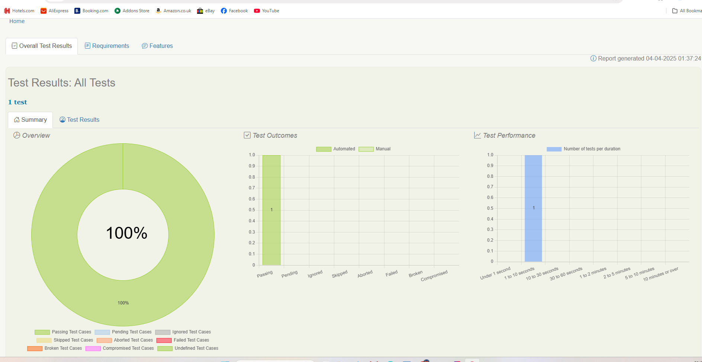
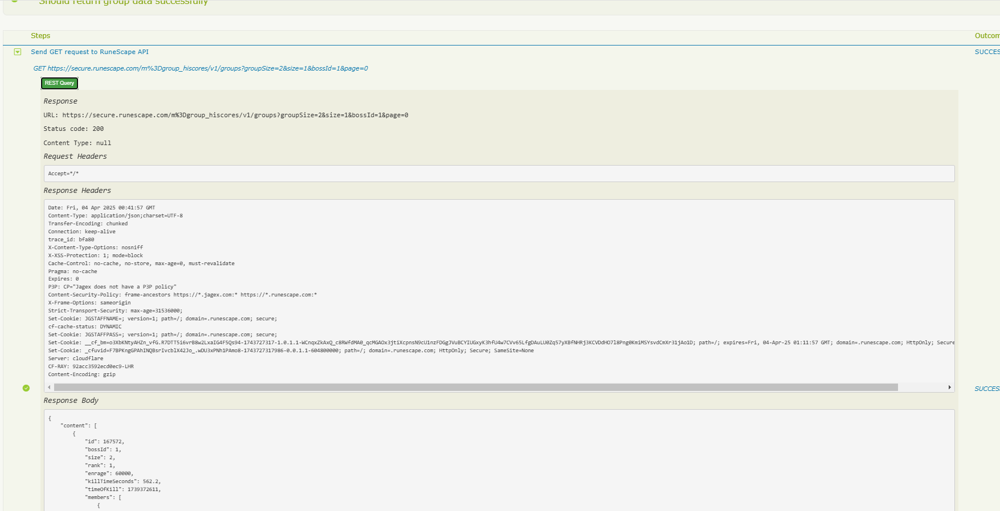
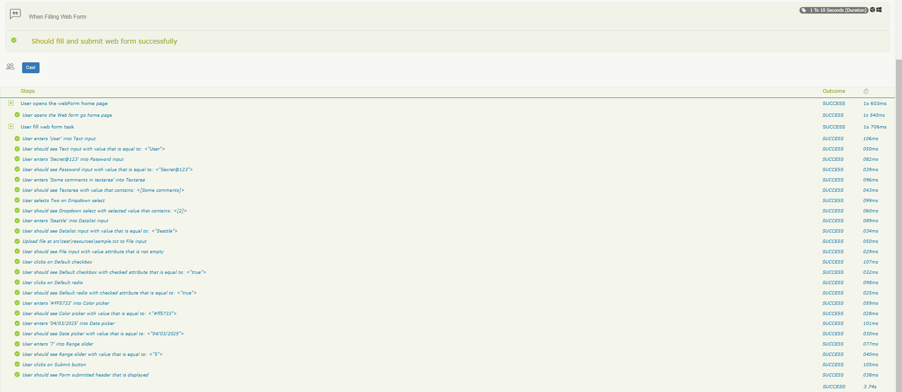
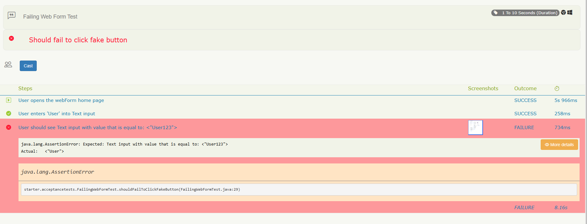

# Serenity BDD Automation Framework with JUnit5

This project is a fully functional UI and API test automation framework using **Serenity BDD** with **JUnit5** and the **Screenplay Pattern**. It includes encrypted test data handling, rich Serenity reports with screenshots, and modular code design for easy maintenance.

---

## 📁 Project Directory Structure

```
src
├── main
│   └── java
│       └── starter
│           └── utils              # 🛠 JSON Reader, Encryption/Decryption, Date Utilities
├── test
│   └── java
│       └── starter
│           ├── acceptancetests   # 💥 Main test classes (UI/API/Fail demo)
│           ├── apitests          # 🌐 API test steps (GET, assertions)
│           ├── navigation        # 🚪 Page navigation utilities
│           ├── tasks             # 🎯 Form filling, interactions with UI validations
│           ├── ui                # 🧱 PageObjects & locators
│           └── utils             # 🛠 Test support utilities (if needed)
resources
└── testdata
    └── formdata.json             # 🧪 Test data file with encrypted password
```

---

## 🔍 Key Features

✅ UI & API test support  
✅ Reads input from JSON files  
✅ Encrypted passwords with `SecurityUtils`  
✅ Screenshot capture on failure  
✅ Detailed Serenity reports with each step  
✅ Designed with the Screenplay Pattern  
✅ Supports GitHub Actions and Jenkins CI

---

## ✅ Sample Test Descriptions

### 1. `FillWebForm.java` (UI Test)
- Reads values from `formdata.json` via `JsonReader`
- Decrypts password using `SecurityUtils.decrypt(...)`
- Performs form fill actions
- Asserts values using `Ensure`
- Submits the form and verifies success via page header

### 2. `FailingWebFormTest.java` (UI Failure Demo)
- Demonstrates Serenity’s screenshot & step logging
- Clicks a non-existent element to force a failure
- Report includes:
  - Clear failure point
  - Screenshot of browser state
  - Stack trace + step info

### 3. `RuneScapeApiTest.java` (API Test)
- Sends GET request to RuneScape API
- Validates:
  - Status code 200
  - Size of `members` in JSON
- Logs complete response for traceability

---

## 🧪 Test Data Example

```json
// testdata/formdata.json
{
  "username": "User",
  "password": "EncryptedStringHere",
  "comment": "Some comments in textarea",
  "dropdown": "Two",
  "datalist": "Seattle",
  "color": "#FF5733",
  "date": "04/03/2025",
  "range": "5"
}
```

### ➕ Decryption in Code
```java
String decryptedPassword = SecurityUtils.decrypt(data.get("password"));
```

---

## ▶️ Run Instructions

### ✅ Run all tests
```bash
./gradlew clean test aggregate
```

### ✅ Run specific test
```bash
./gradlew test --tests starter.acceptancetests.FillWebForm
./gradlew test --tests starter.acceptancetests.RuneScapeApiTest
./gradlew test --tests starter.acceptancetests.FailingWebFormTest
```
## ▶️ Running Tests

| Command | Description                    |
|--------|--------------------------------|
| `./gradlew clean test` | Runs all tests (UI + API)      |
| `./gradlew test --tests starter.acceptancetests.WhenFillingWebForm` | Runs UI test only              |
| `./gradlew test --tests starter.acceptancetests.RuneScapeApiTest` | Runs API test only             |
| `./gradlew test --tests starter.acceptancetests.FailingWebFormTest` | Runs UI Failure test only      |
| `./gradlew aggregate` | Generates Serenity HTML report |

---

### 📊 View Serenity Report
```
target/site/serenity/index.html
```

---

## 📸 Serenity Screenshot Configuration

**Inside `serenity.conf`:**
```hocon
serenity.take.screenshots = FOR_FAILURES
serenity.take.screenshot.for.tasks = BEFORE_AND_AFTER_EACH_STEP
```

**Manually trigger a screenshot:**
```java
Serenity.takeScreenshot();
```

---

## 🛠 Utilities

- `JsonReader.java`: Reads data from JSON
- `SecurityUtils.java`: Encrypt/Decrypt passwords
- `DateTimeUtils.java`: Reusable timestamp helper

---

## 🔄 CI Integration

### ✅ GitHub Actions

```yaml
name: Serenity Tests
on: [push]

jobs:
  test:
    runs-on: ubuntu-latest
    steps:
      - uses: actions/checkout@v2
      - uses: actions/setup-java@v2
        with:
          java-version: '11'
      - run: ./gradlew clean test aggregate
```

### ✅ Jenkins
- Add shell step:
```bash
./gradlew clean test aggregate
```
- Archive: `target/site/serenity`

---

## 🧠 Serenity + Gradle Notes

- Dependencies & plugins configured in `build.gradle`
- `aggregate` task compiles Serenity reports
- Reports include step breakdown, screenshots, input data, failure messages

---

## 📷 Example Output

### 🔹 Form Automation Report
Shows step-by-step with value verification.

### 🔹 Failure Scenario (Fake validation)
Serenity automatically:
- Logs error with screenshots for failures test
- Captures browser state
- Shows exactly where it failed

---
# 📁 Folder Purpose & Usage

| Folder            | Description                                                                                                                        |
|-------------------|------------------------------------------------------------------------------------------------------------------------------------|
| `acceptancetests` | 💥 Contains all main test cases, combining tasks and validations (e.g., `WhenFillingWebForm.java`, `RuneScapeApiTest.java`)        |
| `api`             | 🌐 Contains steps used to perform API calls (GET/POST), and assertions on response                                                 |
| `common`          | 📂 Shared helper classes like JSON data readers and password encryption/decryption logic (JsonReader, SecurityUtils,DateTimeUtils) |
| `navigation`      | 🚪 Navigation logic like `NavigateTo.theHomePage()`                                                                                |
| `tasks`           | 🎯 Actions like form filling, clicking checkboxes, dropdown selections, etc.                                                       |
| `ui`              | 🧱 Web elements (Target locators for input fields, buttons, etc.)                                                                  |
| `resources`       | 🛠 resources file like `formdata`, `serenity.conf`                                                                                 |

## 🧪 UI Test Coverage

The UI form (as shown in the image) is fully automated. The following components are handled and validated:
- ✅ Text input
- ✅ Password field
- ✅ Textarea
- ✅ Select dropdown
- ✅ Datalist dropdown
- ✅ File upload
- ✅ Checkboxes (checked and default)
- ✅ Radio buttons (checked and default)
- ✅ Color picker
- ✅ Date picker
- ✅ Range slider
- ✅ Submit button
- ✅ Validated that the success message is correctly shown as "Submit"

📄 Validations are performed after entering each value, and Serenity step-level reporting captures every action performed during the test.

---

## 📡 API Test Coverage

Validate the RuneScape public API:

**Request:**
```http
GET https://secure.runescape.com/m=group_hiscores/v1/groups
```

**Query Params:**
```java
.queryParam("groupSize", 2)
.queryParam("size", 1)
.queryParam("bossId", 1)
.queryParam("page", 0)
```

**Assertions:**
- Status code: `200`
- Validates:
  - `"content[0].members.size()" == 2`
  - Other fields like `enrage`, `rank`, and `killTimeSeconds` are available for additional checks.

**Logging:**
```java
.log().all(); // Console logging for debugging
```

---


## 📊 Serenity Reports

After test execution:
```
target/site/serenity/index.html
```
You will find detailed test execution steps, input data, and assertion results.
```
Serenity BDD Test Execution Dashboard:
```

```
API Test Execution Results:
```

```
UI Test Execution Results:
```

```
UI Test Failure Results:
```

---

## 🧰 Prerequisites

- Java 11+
- IntelliJ IDEA (recommended)
- Gradle (wrapper included)
- Git

---

## 🛠️ Setup Instructions

```bash
git clone https://github.com/AutoChallenge/SerenityBDDFramework.git
cd SerenityBDDFramework
./gradlew clean test aggregate
```

---

## 🐞 Debugging

Set breakpoints in IntelliJ and run the test using the debug icon. You can also use Serenity’s step events to trace failures.

---

## 🔄 GitHub Actions / CI Integration

Create a `.github/workflows/test.yml` like:
```yaml
name: Run Tests

on: [push]

jobs:
  test:
    runs-on: ubuntu-latest
    steps:
      - uses: actions/checkout@v2
      - name: Set up JDK
        uses: actions/setup-java@v2
        with:
          java-version: '11'
      - name: Run Tests
        run: ./gradlew clean test aggregate
```

---

## 🔗 Jenkins Integration

- Use a Freestyle or Pipeline job
- Configure Git URL
- Add build step:
```bash
./gradlew clean test aggregate
```
- Archive reports from `target/site/serenity`

---

## 📦 Gradle Notes

- `build.gradle` handles Serenity, RestAssured, and JUnit5 dependencies
- Serenity plugins configured to auto-generate HTML reports

---

💬 **Happy Testing!**